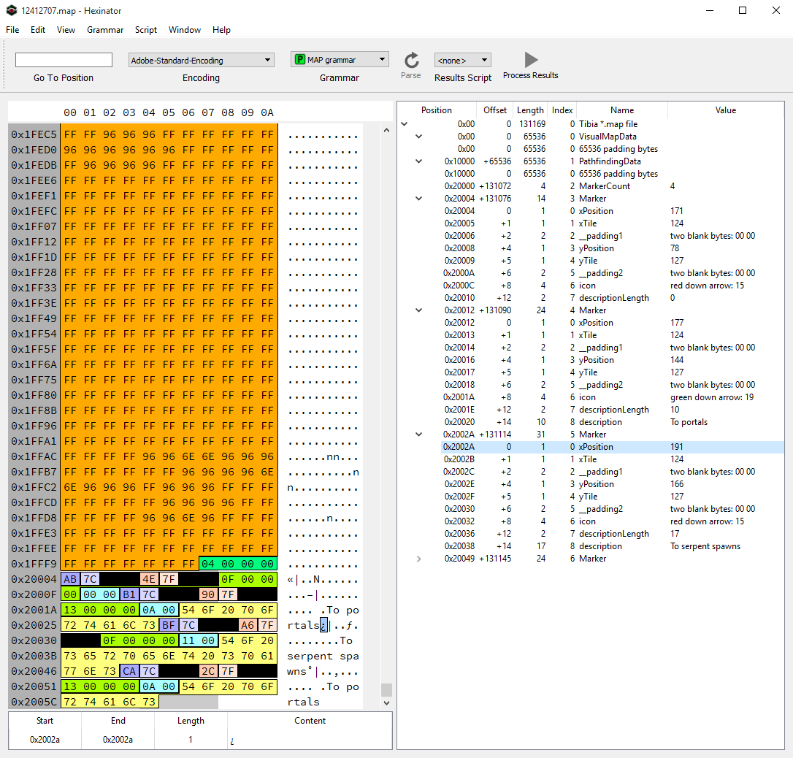

# Tibia `*.map` grammar 

This is a [binary grammar](https://www.synalysis.net/formats.xml) for `*.map` files as generated by the [Tibia](https://secure.tibia.com/news/?subtopic=latestnews) client. The grammar is compatible with [Hexinator](https://hexinator.com/) and [Synalyze It!](https://www.synalysis.net/).

## Author

|  |
|---|
| [Mathias Bynens](https://mathiasbynens.be/) |
